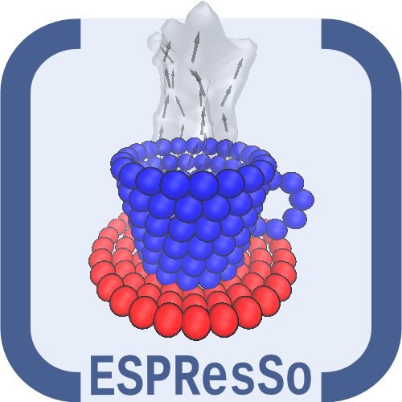

<!-- TABLE OF CONTENTS -->
<details>
  <summary>Table of Contents</summary>
  <ol>
    <li><a href="#about-the-project">About The Project</a></li>
    <li>
      <a href="#getting-started">Getting Started</a>
      <ul>
        <li><a href="#prerequisites">Prerequisites</a></li>
        <li><a href="#installation">Installation</a></li>
      </ul>
    </li>
    <li><a href="#usage">Usage</a></li>
    <li><a href="#license">License</a></li>
    <li><a href="#contact">Contact</a></li>
  </ol>
</details>


<!-- ABOUT THE PROJECT -->
## About The Project

<!-- PROJECT LOGO -->
<br />
<div align="center">
  <a href="https://github.com/github_username/repo_name">
    
  </a>
</div>

</br>
</br>
</br>

Installing EspressoMD on a Work station is always been a diffucult task due to its lots of dependencies and incopatibality with CUDA and c compiler. Default docker images does not with Dockerfile and any simple modification causes lots of comaptibility issues. I want to create a git repository that will contain different EspressoMD packages with dockerfile ready to use in any machine. - I think this is it.

Here's why:
* Minimal time spent on installing EspressoMD 
* Works on any machine any time any where
* You should focus on simulaiton not on installation

</br>
</br>
</br>


<!-- GETTING STARTED -->
## Getting Started

The machine need to have docker installed. To install docker follow the instruction on [Docker Page](https://docs.docker.com/desktop/install/linux-install/)

### Prerequisites

The machine need to have docker installed. To install docker follow the instruction on [Docker Page](https://docs.docker.com/desktop/install/linux-install/)


### Installation

To install espessomd with docker simply use the build command

1. Create a directory for the project and change directory
   ```sh
   mkdir test_espresso
   cd test_espresso
   ```
2. Clone the repo
   ```sh
   git clone https://github.com/Khayrulbuet13/EspressoMD.git
   ```
3. We will just need the docker file here so 
   ```sh
   cp EspressoMD/Dockerfile .
   rm -r EspressoMD
   ```
4. build the container using build command
   ```sh
   docker build -t espresso .
   ```
5. run the container in background
   ```sh
   docker run --gpus all -t -d --name my_espresso espresso
   ```
6. To start interactive mode
   ```sh
   Start interactive mode my_espresso bash
   ```


<!-- USAGE EXAMPLES -->
## Usage

This repo is for easy installation of EspressoMD Molecular dynamics package,

_For more examples, please refer to the [Documentation](https://espressomd.github.io/doc/index.html)_


<!-- LICENSE -->
## License

Distributed under the MIT License. See `LICENSE.txt` for more information.


<!-- CONTACT -->
## Contact

Khayrul Islam - [@LinedIN](https://www.linkedin.com/in/khayrulbuet13/) - khayrulbuet13@gmail.com

Project Link: [EspressoMD](https://github.com/Khayrulbuet13/EspressoMD.git)

<p align="right">(<a href="#readme-top">back to top</a>)</p>
